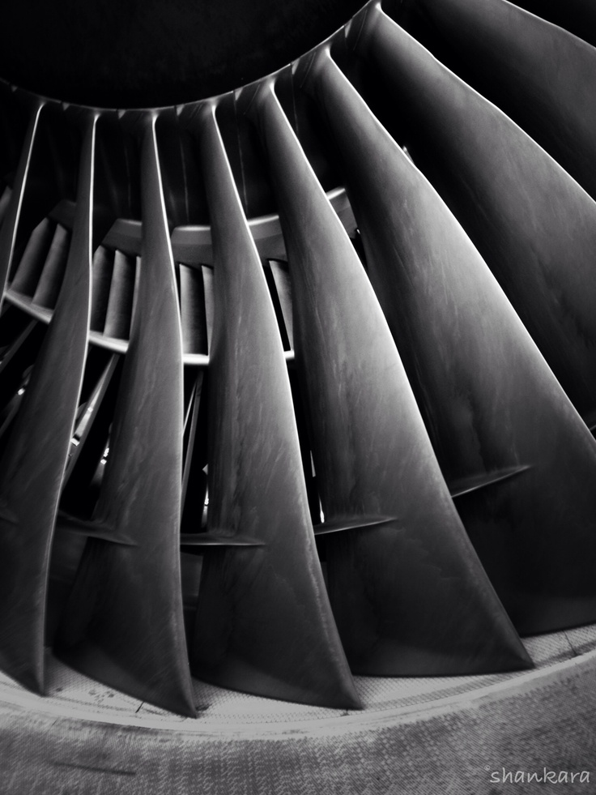

# Design-of-a-fan-blade-for-an-Aircraft-Turbine-Engine

THE RESEARCH PAPER IS ATTACHED TO THE REPO (18-pages)

This paper discusses the several design criteria that need to be considered during the selection
process of an appropriate material for a blade of an aircraft turbine engine. It is explained how
safety is the largest determining factor for most of the design criteria. Several mechanical
properties regarding the safety of the appropriate material for the blade are explained and
compared for different materials. The best overall material of Carbon Fiber Reinforced
Composites was accordingly with an appropriate justification for our selection

